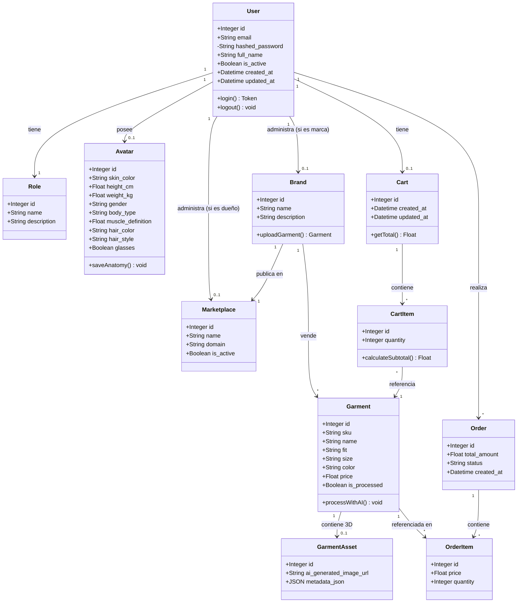
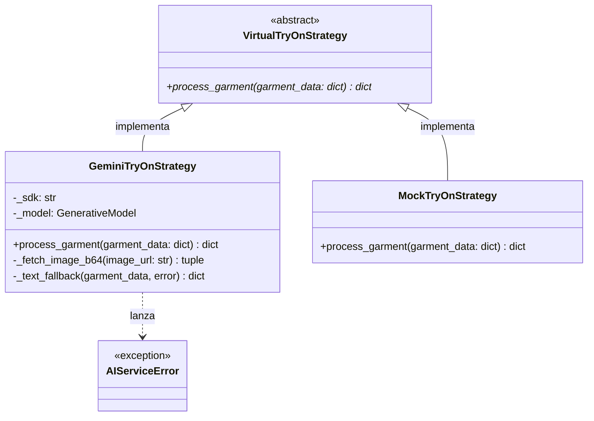
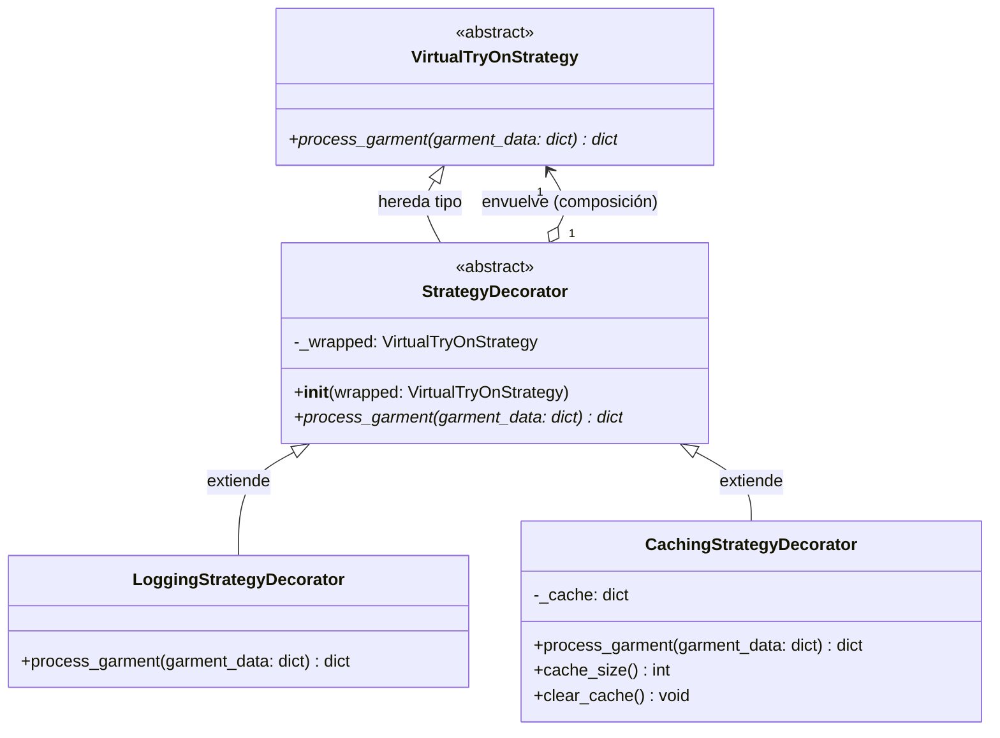
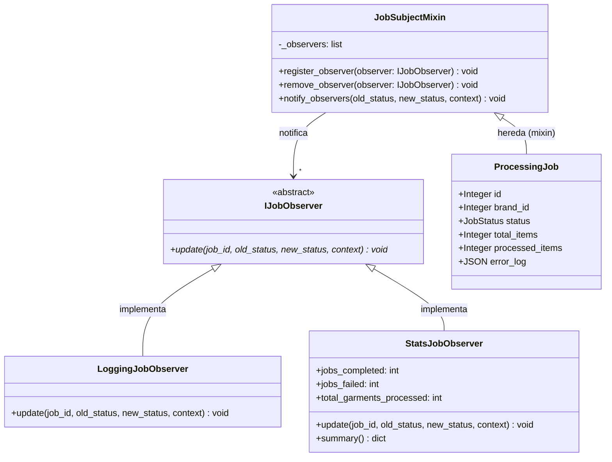

# Diagrama de Clases UML: Modelos de Dominio + Patrones de Diseño

Este diagrama describe las clases principales de TryOnHub y cómo interactúan, siguiendo las convenciones UML recomendadas en clase (usando **atributos** para tipos de datos primitivos y **asociaciones** para relaciones significativas entre clases).

## Modelo de Dominio

---

## Patrones de Diseño

### Strategy Pattern — `ai_strategy.py`

---

### Decorator Pattern — `strategy_decorators.py`

---

### Observer Pattern — `job_observers.py`

---

### Justificación de Diseño

*   **Atributos vs Asociaciones**: Los datos primitivos (como `skin_color` o `price`) están modelados como *Atributos* internos, mientras que las relaciones de dominio importante están modeladas como *Asociaciones* (flechas).
*   **Encapsulamiento**: Campos sensibles como la contraseña (`hashed_password`) se modelan con visibilidad privada (`-`).
*   **Cart como entidad intermedia**: El `Cart` es una entidad propia porque tiene identidad propia, timestamps y puede persistir entre sesiones. Un `User` tiene exactamente un `Cart` (composición 1..1).
*   **Strategy Pattern**: Permite que el backend de IA evolucione independientemente de los routers. Cambiar de Gemini a OpenAI requiere cero cambios fuera de `ai_strategy.py`.
*   **Decorator Pattern**: Añade logging y caché a la estrategia de IA en runtime, sin modificar `GeminiTryOnStrategy` (Open/Closed Principle). Igual al ejemplo de Starbuzz Coffee del libro.
*   **Observer Pattern**: Desacopla el sistema de notificaciones del procesamiento de jobs. Cualquier nuevo Observer (Slack, email, WebSocket) se agrega sin tocar `ProcessingJob` ni `process_catalog_background`.
