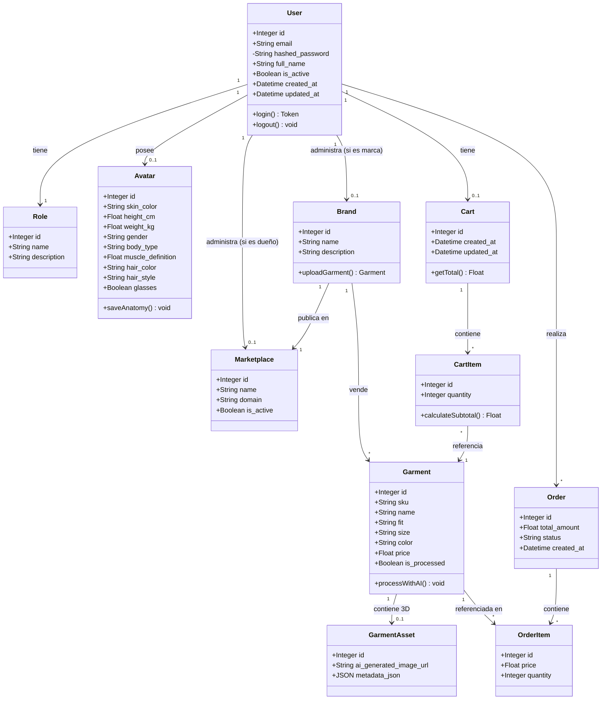

# Diagrama de Clases UML: Modelos de Dominio

Este diagrama describe las clases principales de TryOnHub y cómo interactúan, siguiendo las convenciones UML recomendadas en clase (usando **atributos** para tipos de datos primitivos y **asociaciones** para relaciones significativas entre clases).

### Justificación de Diseño (Patrón UML)
*   **Atributos vs Asociaciones**: Tal como sugiere la buena práctica de UML, los datos primitivos (como `skin_color` o `price`) están modelados como *Atributos* internos de las clases, mientras que las relaciones complejas y de dominio importante (como el vínculo entre un `User` y su `Avatar`, o una `Brand` y sus `Garment`) están modeladas como *Asociaciones* (flechas).
*   **Encapsulamiento**: Campos sensibles como la contraseña (`hashed_password`) se modelan con visibilidad privada (`-`).
*   **Cart como entidad intermedia**: El `Cart` es una entidad propia (no una relación directa User→CartItem) porque tiene identidad propia, timestamps y puede persistir entre sesiones. Un `User` tiene exactamente un `Cart` (composición 1..1), y ese `Cart` contiene múltiples `CartItem`. Esta separación facilita operaciones como limpiar el carrito sin afectar el historial de órdenes.
