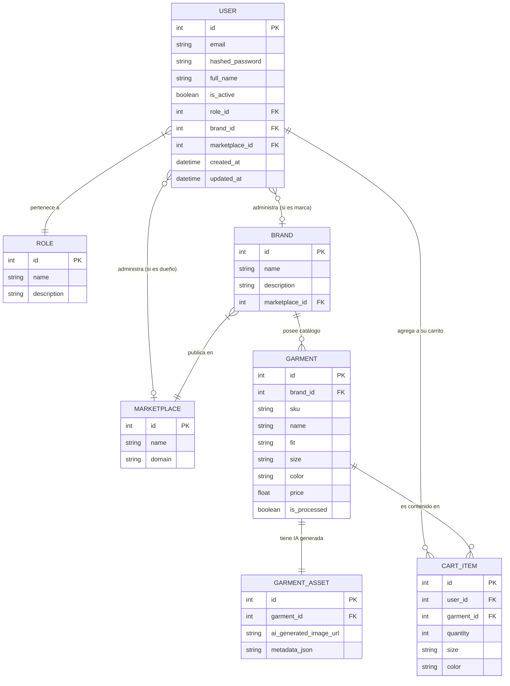

# Diagrama de Entidad-Relación (ERD)

A continuación se detalla el esquema de la base de datos de TryOnHub, enfocado en los roles, autenticación de usuarios, organización de marcas y el catálogo de prendas generativas.

## Relaciones Principales
- Un **User** puede ser Cliente, Marca o Administrador (basado en `role_id`).
- Si un usuario tiene el rol de Marca, estará atado obligatoriamente a un `brand_id`.
- Cuando una Marca crea un **Garment** (Prenda), el flujo transaccional asegura que se comunique con la IA (Gemini Vision).
- Si la IA procesa todo exitosamente, se anexa un **GarmentAsset** que contiene la URL subida y la `metadata_json` (con parámetros físicos y de color del 3D).
- Todos los clientes pueden añadir prendas al **CartItem**.
