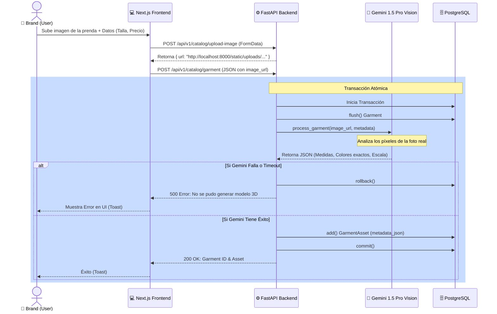

# Diagrama de Secuencia UML: Subida de Prendas y Generación 3D

Este diagrama ilustra cómo funciona la arquitectura de TryOnHub cuando una marca sube un nuevo producto y nuestra Inteligencia Artificial parametriza el diseño 3D.

### Explicación Técnica
1. **Transacción Atómica**: Todo el proceso de base de datos (`Garment` y `GarmentAsset`) se hace dentro de una única transacción. Si Gemini Vision se cae, todo se deshace (`rollback`), evitando dejar la base de datos con prendas "zombis" que no pueden mostrarse en el probador 3D.
2. **Vision-Driven Parameters**: Gemini Vision extrae directamente los colores predominantes en HEX y las medidas a escala basándose en la foto real que sube el usuario. No usamos texturas estáticas, sino variables React Three Fiber (`material.color.set(hex)`).
