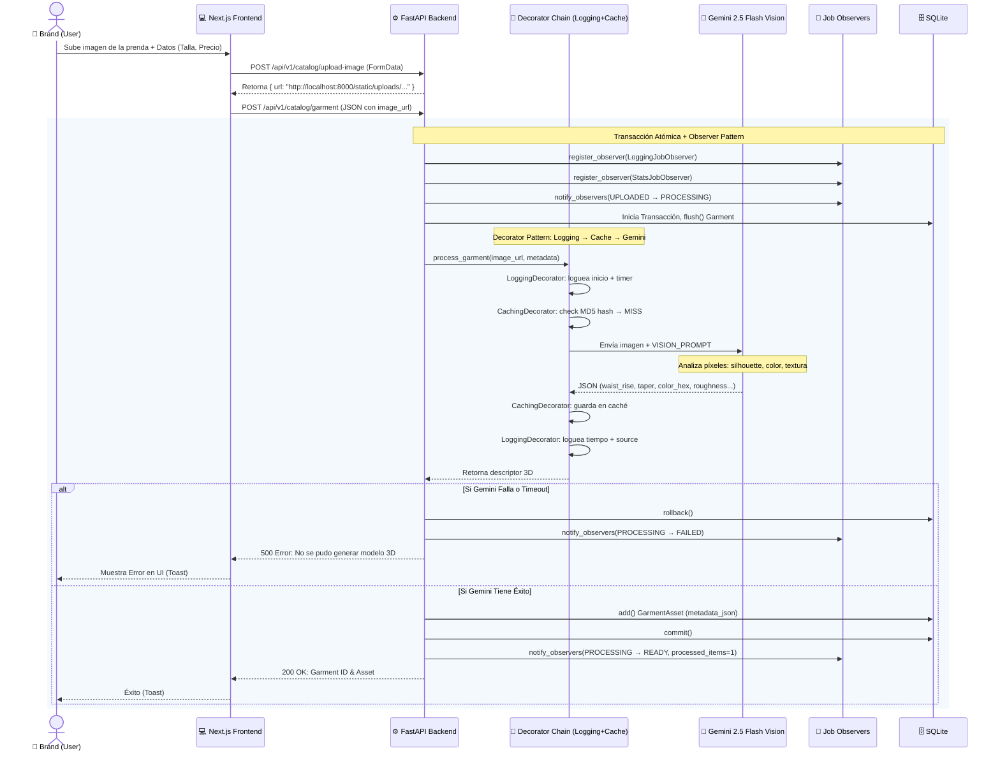
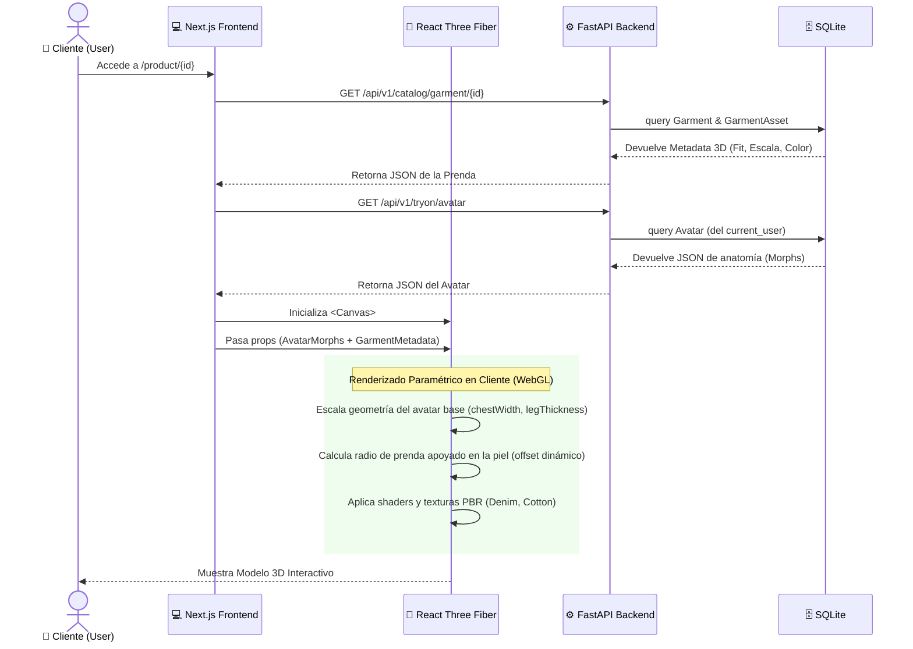
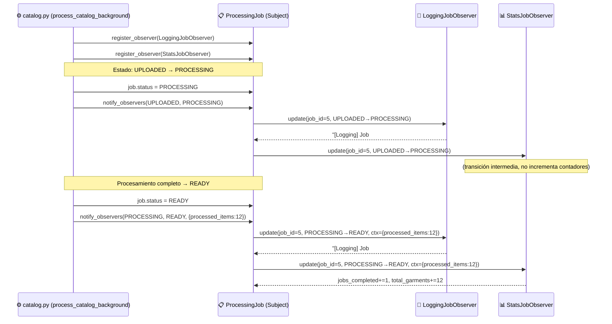
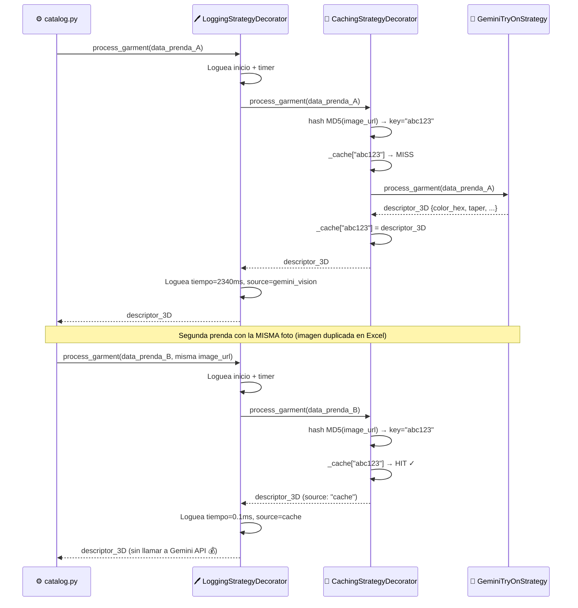

# Diagrama de Secuencia UML: TryOnHub

Este documento contiene los diagramas de secuencia para los casos de uso más importantes del sistema, de acuerdo a las buenas prácticas de UML.

## 1. Subida de Prendas y Generación 3D (Brand)

Este diagrama ilustra cómo funciona la arquitectura cuando una marca sube un nuevo producto. Incluye el **Patrón Decorator** sobre la estrategia de IA y el **Patrón Observer** sobre el Job de procesamiento.

## 2. Probador Virtual (Try-On) Interactiva (Client)

Este diagrama detalla la interacción principal del sistema: cuando un usuario entra a ver cómo le queda una prenda en su avatar 3D.

## 3. Flujo de Observer — Cambio de Estado de Jobs

Este diagrama muestra el modelo **Push** del Patrón Observer aplicado al procesamiento de catálogos.

## 4. Flujo de Decorator — Cadena sobre GeminiTryOnStrategy

Este diagrama muestra cómo funciona la cadena `Logging(Cache(Gemini))` en el procesamiento de una prenda.

