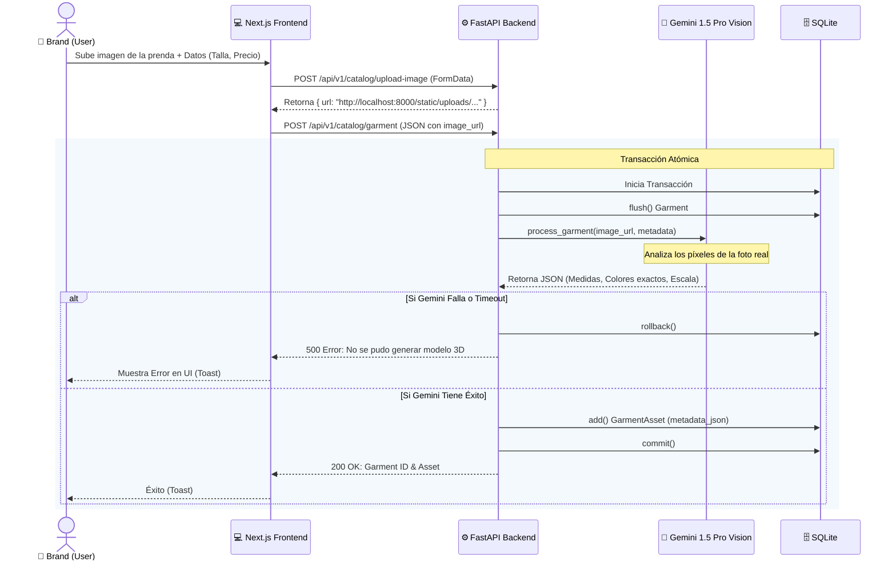
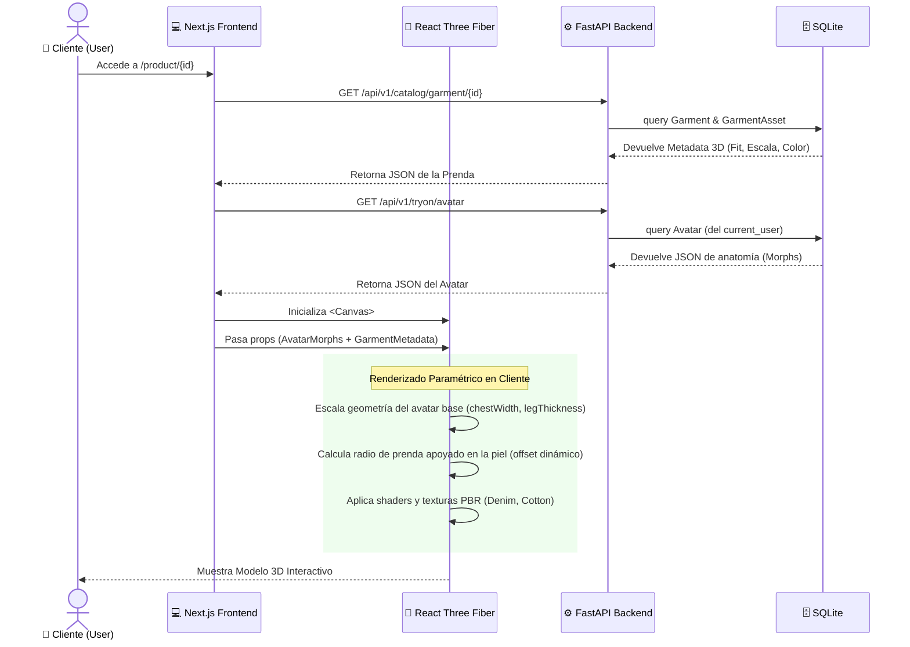

# Diagrama de Secuencia UML: TryOnHub

Este documento contiene los diagramas de secuencia para los casos de uso más importantes del sistema, de acuerdo a las buenas prácticas de UML.

## 1. Subida de Prendas y Generación 3D (Brand)

Este diagrama ilustra cómo funciona la arquitectura cuando una marca sube un nuevo producto y nuestra Inteligencia Artificial parametriza el diseño 3D.

## 2. Probador Virtual (Try-On) Interactiva (Client)

Este diagrama detalla la interacción principal del sistema: cuando un usuario entra a ver cómo le queda una prenda en su avatar 3D.

